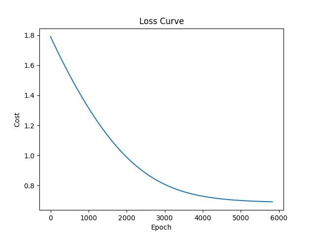
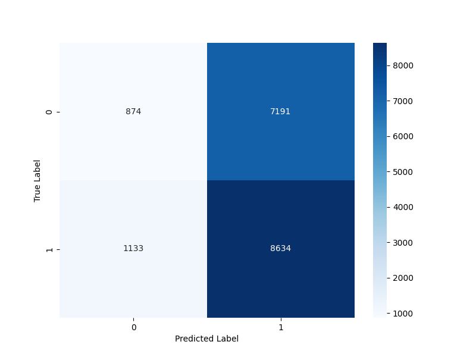

# Logistic-Regression
Implementation of Logistic Regression from first principles in python. For binary classification.

The implementation includes feature improvement through minmax scaling/standardization and L2 regularization in the gradient descent function.

## Features

- Logistic regression model built from first principles using gradient descent.
- Minmax feature scaling/standardization for improved model performance.
- Regularization (L2) in the gradient descent function.
- Example usage and dataset included in the repository. The mushroom dataset was used to predict the "class". 1 - Poisonous, 0 - Not Poisonous.

## Getting Started

1. Clone the repository:

```bash
git clone https://github.com/nicholasbaard/Logistic-Regression.git
```

2. Install the required dependencies:

```bash
pip install requirements.txt
```

3. Run the example script:

```bash
cd src
python main.py
```

## Arguments

- `--dataset_path`: Path to the dataset (default: `'../data/mushroom_cleaned.csv'`)
- `--cols_to_drop`: Columns to drop (default: `[]`)
- `--target_col`: Target column (default: `'class'`)
- `--alpha`: Learning rate for gradient descent (default: `0.0001`)
- `--eps`: Convergence threshold for gradient descent (default: `0.00001`)
- `--lambda`: Regularization parameter (default: `0.001`)
- `--scaler_type`: Scaler type - `'minmax'` or `'standardization'` (default: `'minmax'`)
- `--show_plot`: Whether you want the plots to be shown (default: `False`)

This will train a logistic regression model on a sample dataset and visualize the results.

### Loss Curve

### Test Set Confusion Matrix


## Contributing

Contributions are welcome! If you find any issues or have suggestions for improvements, please open an issue or submit a pull request.
